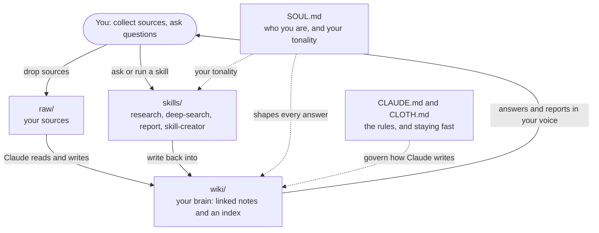

# Second Brain

An open, local AI second brain you run with Claude Code and Obsidian. You collect your sources; Claude reads
them and keeps a living, linked wiki of what they say, the projects you're working on, and the people you
work with, so it remembers and gets sharper as you go. Good for research, consulting, or any work where you
want your agent to remember. Plain markdown, yours, no lock-in.

*Sharing this with a colleague? A one-page overview to hand on is in [docs/QUICKSTART.md](docs/QUICKSTART.md).*

## Start (about five minutes)

You need **Claude Code** (the agent, needs a Claude subscription) and **Obsidian** (the viewer, free). New
to either, or want the per-situation walkthrough? See [SETUP.md](SETUP.md).

1. **Open Claude Code, paste this, and say "set up my second brain":**
   > https://github.com/Krishna-kai/claude-skills-second-brain
   Claude sets it up and tells you which folder your brain is in. Nothing to configure, no folder to make
   first.
2. **Open that folder in Obsidian** (File -> Open folder as vault) to see your wiki and its graph.
3. **Drop a source into `raw/`** (a reading, a PDF, your notes) and say **"read what's in raw and start my
   wiki."** Then ask questions, say "add this" as you collect more, or "lint my wiki" to tidy up.

Claude maintains the brain; Obsidian is your window into it.

> **If you're the Claude agent reading this:** set up the user's second brain without disturbing any files
> they may already have in the folder.
> - If the current folder is **empty**, clone into it:
>   `git clone https://github.com/Krishna-kai/claude-skills-second-brain.git . && ls`
> - If the current folder **already has files**, clone into a fresh subfolder instead so nothing collides:
>   `git clone https://github.com/Krishna-kai/claude-skills-second-brain.git second-brain && cd second-brain && ls`
>
> Then read `CLAUDE.md`, follow its "If you were just pointed here" setup, and tell the user which folder
> holds their brain so they know which one to open in Obsidian.

## What's inside, and how it fits together

You're the architect, asking the questions and deciding what matters. Claude does the reading, linking, and
filing, the part that makes people abandon their notes. When Claude sets up your brain, you get a handful of
plain files:

- **`SOUL.md` - who you are.** At setup, Claude asks you a few short questions: your name, what you do, who
  you work with, how you like to work, and your **tonality** (how you want Claude to sound, and to write when
  it writes for you). Claude fills it in for you, and reads it before every answer, so the brain fits you
  from day one. Edit it anytime.
- **`raw/` - your sources.** Drop readings, PDFs, and notes here. Claude reads them and never changes them.
- **`wiki/` - your brain.** The linked notes Claude writes from your sources, with `wiki/index.md` as the
  catalog of everything in it.
- **`skills/` - the workflows.** Named jobs you trigger by asking: `research` (investigate a topic and save
  it with sources), `deep-search` (a current, multi-source sweep), `report` (turn your brain into a sourced
  write-up, in your tonality), and `skill-creator` (build your own). More on these in
  [skills/README.md](skills/README.md).
- **`CLAUDE.md` and `CLOTH.md` - the rules.** `CLAUDE.md` is the schema that makes Claude a disciplined
  brain-keeper. `CLOTH.md` keeps it fast by loading only what a task needs, never the whole brain, however
  big it grows. You do not edit these.

**How they connect:** you drop sources into `raw/`; Claude reads them and writes linked pages into `wiki/`,
following the rules in `CLAUDE.md` and your profile in `SOUL.md`; `CLOTH.md` keeps it fast as it grows; the
skills are the workflows you trigger; and when Claude writes for you, it does it in your tonality from
`SOUL.md`. You collect and ask; Claude reads, links, and remembers.

At a glance:

## Credit

We didn't invent this. We borrowed brilliance from the open source community and built on it.

- The wiki pattern (raw sources, an LLM-built wiki, an index) is **Andrej Karpathy's "LLM Wiki"**:
  https://gist.github.com/karpathy/442a6bf555914893e9891c11519de94f
- The idea of turning Claude Code itself into a second brain, a schema file that makes the agent a
  disciplined maintainer, is **Cole Medin's** work at Dynamous AI:
  https://github.com/coleam00/second-brain-skills
- The pattern of an agent that reads who it is and how to behave before it acts comes from the
  **soul.md and OpenClaw community** (Aaron Mars): https://github.com/aaronjmars/soul.md
- `CLOTH.md` builds on the field's idea of progressive disclosure and context engineering. The named
  contract is ours. The idea isn't.

Plain markdown. No database, no lock-in. Your brain, your files.
